# Adaptive Fuzzy Logic-Based Steganographic Encryption Framework

Research code for a Mamdani fuzzy inference system that assigns per-pixel LSB embedding depth (1 to 3 bits) from local image features, combined with Argon2id key derivation and AES-256-GCM payload encryption. The framework is evaluated on 1,000 synthetic images and validated on 600 real-world images from BOSSBase 1.01, BOWS2, and MIRFLICKR-25K.

**Repository:** [github.com/kavyabhand/Fuzzy-Steganography](https://github.com/kavyabhand/Fuzzy-Steganography)

---

## Table of Contents

1. [Quick Start](#quick-start)
2. [Reproducibility](#reproducibility)
3. [Datasets](#datasets)
4. [Installation](#installation)
5. [Running Experiments](#running-experiments)
6. [Project Structure](#project-structure)
7. [Method Overview](#method-overview)
8. [Results Summary](#results-summary)
9. [Limitations](#limitations)
10. [Citation](#citation)

---

## Quick Start

Verify the codebase, confirm published metrics, and regenerate figures without re-running the full pipeline:

```bash
git clone https://github.com/kavyabhand/Fuzzy-Steganography.git
cd Fuzzy-Steganography
pip install -r requirements.txt

# Module and round-trip smoke tests
python test_smoke.py

# Confirm committed CSV outputs match README headline numbers
python scripts/verify_reproducibility.py

# Regenerate README figures from committed results
python scripts/regenerate_figures.py
```

To reproduce the full synthetic evaluation (1,000 images, approximately 1.5 hours on a modern CPU):

```bash
python experiments/run_v2.py --config config/config_v2.yaml
```

---

## Reproducibility

This repository is structured for journal artifact review. The following guarantees are provided.

| Requirement | How it is satisfied |
|-------------|---------------------|
| Runnable code | All modules pass `test_smoke.py`; experiment runners are CLI-driven |
| Fixed random seed | `random_seed: 42` in every config file |
| Committed results | Paper metrics are stored as CSV/JSON under `data/outputs_v2/` and `data/outputs_*/` |
| Metric verification | `python scripts/verify_reproducibility.py` checks headline PSNR, AUC, and sync values |
| Environment logging | `data/outputs_v2/v2_environment.json` records Python, NumPy, platform, and full config |
| Figure regeneration | `python scripts/regenerate_figures.py` rebuilds README plots from CSV outputs |
| Public datasets | Download URLs and automated fetch script documented in [data/README.md](data/README.md) |

### V2 pipeline stages

The primary reproduction path is `experiments/run_v2.py`, which executes nine stages:

| Stage | Command | Output |
|-------|---------|--------|
| 1 | `--stage 1` | Synthetic dataset in `data/covers_v2/` |
| 2 | `--stage 2` | `v2_all_results.csv` (15,000 rows) |
| 3 | `--stage 3` | `v2_statistical_tests.csv` |
| 4 | `--stage 4` | `v2_sync_analysis.csv` |
| 5 | `--stage 5` | `v2_deep_steganalysis.csv`, `srm_features.npz`, `roc_curves.npz` |
| 6 | `--stage 6` | `v2_ablation_results.csv` |
| 7 | `--stage 7` | `v2_complexity.csv` |
| 8 | `--stage 8` | Plots in `data/outputs_v2/plots/` |
| 9 | `--stage 9` | `v2_environment.json` |

Run a single stage:

```bash
python experiments/run_v2.py --config config/config_v2.yaml --stage 3
```

### Experiment password

Real-dataset and V2 runners use a fixed research password for reproducibility:

```
research_experiment_key_2025
```

This is hardcoded in `experiments/run_v2.py` and `experiments/run_real_dataset.py`. Keys are derived via Argon2id before AES-256-GCM encryption of payloads.

---

## Datasets

### Synthetic corpus (primary, no download required)

1,000 RGB PNG images (256 x 256) in five texture categories, generated with seed 42:

| Category | Count | Description |
|----------|-------|-------------|
| Smooth | 200 | Gradients with Gaussian blur |
| Noise | 200 | High-entropy random patterns |
| Natural | 200 | 1/f spectral noise |
| Textured | 200 | Sinusoidal and Gabor patterns |
| Mixed | 200 | Patchwork of region types |

Generated automatically by Stage 1 of the V2 pipeline into `data/covers_v2/`.

### Real-world benchmarks (download required)

Each benchmark uses the first 200 images in sorted filename order.

| Dataset | Format | Local path | Public source |
|---------|--------|------------|---------------|
| BOSSBase 1.01 | 512 x 512 PGM | `data/BOSSbase_1.01/` | [Binghamton DDE](http://dde.binghamton.edu/download/ImageDB/BOSSbase_1.01.zip) or [CVUT Stego Data](https://agents.fel.cvut.cz/stegodata/BOSSbase/BOSSbase_1.01.zip) |
| BOWS2 | 512 x 512 PGM | `data/BOWS2/cover/` | [TU Dresden RSP](http://dud.inf.tu-dresden.de/~westfeld/rsp/bows2-1g.tar.gz) |
| MIRFLICKR-25K | JPEG (resized to 256 x 256) | `data/mirflickr/` | [LIACS Media Lab](http://press.liacs.nl/mirflickr/mirflickr25k.zip) |

Automated download:

```bash
python scripts/download_datasets.py --dataset all
```

Full dataset documentation, citations, and manual download instructions: [data/README.md](data/README.md).

---

## Installation

**Requirements:** Python 3.9 or newer

```bash
pip install -r requirements.txt
```

| Package | Purpose |
|---------|---------|
| numpy, scipy | Array operations, statistics, convolution |
| Pillow | Image I/O |
| cryptography | AES-256-GCM |
| argon2-cffi | Argon2id KDF (falls back to PBKDF2 if unavailable) |
| PyYAML | Configuration loading |
| pandas, matplotlib, tabulate | Results analysis and plotting |
| requests, tqdm | Dataset download script |

Optional: install `argon2-cffi` for production-grade key derivation matching the paper configuration (t=3, m=64 MB, p=4).

---

## Running Experiments

### 1. Smoke test

```bash
python test_smoke.py
```

Validates imports, KDF, AES-GCM round-trip, fixed and adaptive LSB embed/extract, quality metrics, steganalysis detectors, and the fuzzy controller.

### 2. Full V2 synthetic pipeline (primary)

```bash
python experiments/run_v2.py --config config/config_v2.yaml
```

Produces all synthetic results, statistics, steganalysis, ablation, complexity profiling, plots, and environment metadata under `data/outputs_v2/`.

### 3. Real-dataset validation

Download benchmarks first (see [Datasets](#datasets)), then:

```bash
python experiments/run_real_dataset.py --config config/config_bossbase.yaml
python experiments/run_real_dataset.py --config config/config_bows2.yaml
python experiments/run_real_dataset.py --config config/config_mirflickr.yaml
```

Outputs per dataset: `summary.json`, `all_results.csv`, `deep_steganalysis.csv`, `complexity.csv`, `statistical_tests.csv`, and plots.

### 4. Legacy V1 quick pipeline

For a small baseline comparison on up to five cover images:

```bash
python main.py --all --config config/config.yaml
```

Without `--all`, `main.py` prints usage only. Place cover images in `data/covers/` or let the runner generate a single synthetic fallback image.

### 5. Embed and extract (API usage)

```python
from PIL import Image
from crypto.kdf import derive_key
from crypto.aes import encrypt_bytes, decrypt_bytes
from stego.lsb_adaptive import AdaptiveEmbedder

key = derive_key("your-password")
ciphertext = encrypt_bytes(b"secret message", key)

img = Image.open("cover.png")
embedder = AdaptiveEmbedder()
stego_img = embedder.embed(img, ciphertext)
stego_img.save("stego.png")

recovered = embedder.extract(stego_img, len(ciphertext))
plaintext = decrypt_bytes(recovered, key)
```

### 6. Jupyter notebook

`final.ipynb` is a 57-cell end-to-end notebook covering the full pipeline, visualizations, and all four dataset evaluations. Run locally with Jupyter Lab or upload to Kaggle:

```bash
bash scripts/upload_to_kaggle.sh "https://kkb-production.jupyter-proxy.kaggle.net?token=..."
```

### 7. Research report generation

Regenerate the Markdown research report from V2 CSV outputs:

```bash
python experiments/generate_report.py --results data/outputs_v2 --output docs/research_report_v2.md
```

---

## Project Structure

```
.
├── analysis/               # Metrics, steganalysis, statistics, sync validation
├── config/                 # YAML experiment configurations
├── crypto/                 # Argon2id KDF and AES-256-GCM
├── data/
│   ├── README.md           # Dataset sources, layout, and download instructions
│   ├── outputs_v2/         # Synthetic experiment results (committed)
│   └── outputs_*/          # Real-dataset results (committed)
├── docs/
│   ├── paper/              # LaTeX manuscript (Elsevier elsarticle)
│   ├── paper_draft.md      # IEEE TIFS-format paper draft
│   └── research_report_v2.md
├── experiments/            # Pipeline runners and dataset generator
├── figures/                # README and paper figures (PNG/PDF)
├── scripts/
│   ├── download_datasets.py
│   ├── regenerate_figures.py
│   ├── verify_reproducibility.py
│   └── upload_to_kaggle.sh
├── stego/                  # Fuzzy controller, entropy/edge features, LSB engines
├── final.ipynb             # End-to-end Jupyter notebook
├── main.py                 # Legacy V1 entry point
├── test_smoke.py           # Module smoke tests
└── requirements.txt
```

---

## Method Overview

### Architecture

```
Cover Image -> LSB-strip -> Entropy + Sobel edges -> Mamdani FIS (27 rules)
                                                      -> Depth map D(x,y)
Plaintext -> Argon2id -> AES-256-GCM -> Ciphertext -> PRNG-permuted adaptive LSB embed -> Stego
```

The decoder recomputes the identical depth map from the LSB-stripped stego image. The depth map is never transmitted. Feature extraction uses `pixel & 0xF8`, so embedding in the lower three bits does not alter the features used for depth assignment.

### Fuzzy inference

Three inputs (entropy, edge magnitude, capacity pressure) map to embedding depth via 27 Mamdani rules over {Low, Medium, High} cubed. Trapezoidal membership functions and centroid defuzzification produce integer depths in {1, 2, 3}. Inference is fully vectorized over NumPy arrays.

### Evaluation protocol

| Setting | Value |
|---------|-------|
| Methods | Fixed-LSB-1, Fixed-LSB-2, Adaptive |
| Embedding rates | 0.05, 0.10, 0.20, 0.30, 0.40 bpp |
| Quality metrics | PSNR, SSIM, MSE, KL divergence |
| Classical steganalysis | RS analysis, chi-square, sample pair analysis |
| Feature-based steganalysis | SRM-lite (6 filters, ~90 features) + Fisher LDA, 5-fold CV |
| Statistics | Paired t-tests, Bonferroni correction, Cohen's d, 95% CI, power |

---

## Results Summary

### Synthetic evaluation (N=1,000, 0.05 bpp)

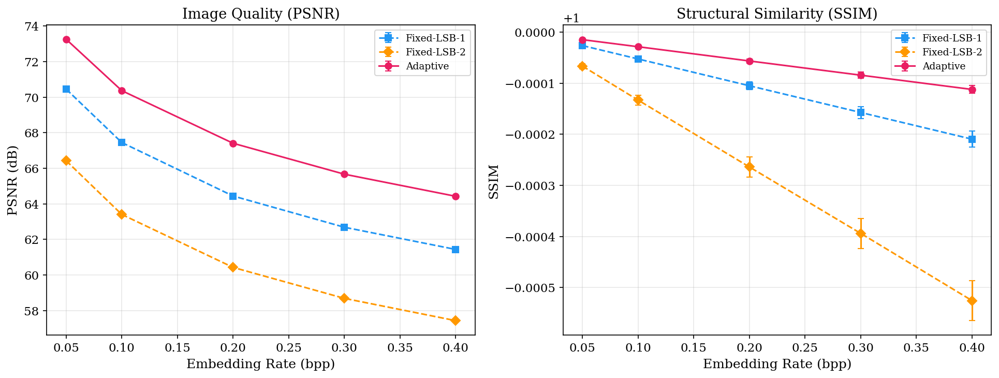

| Method | PSNR (dB) | SRM-lite AUC |
|--------|-----------|--------------|
| Fixed-LSB-1 | 70.45 | 0.754 |
| Fixed-LSB-2 | 66.43 | 0.710 |
| Adaptive | **73.25** | **0.660** |

Adaptive improves PSNR by +2.80 dB over Fixed-LSB-1 (p < 0.001, Cohen's d = -18.53) and reduces SRM-lite AUC by 0.094, indicating harder detection. Depth map synchronization shows 0.0% pixel disagreement across 200 validation images.

### Real-dataset validation (200 images each)

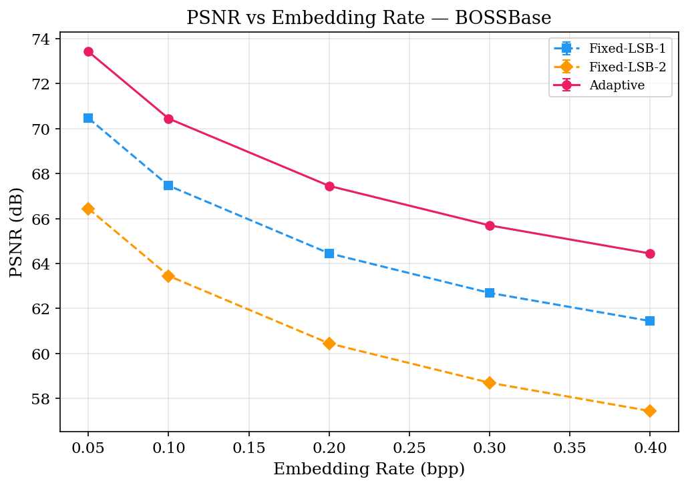
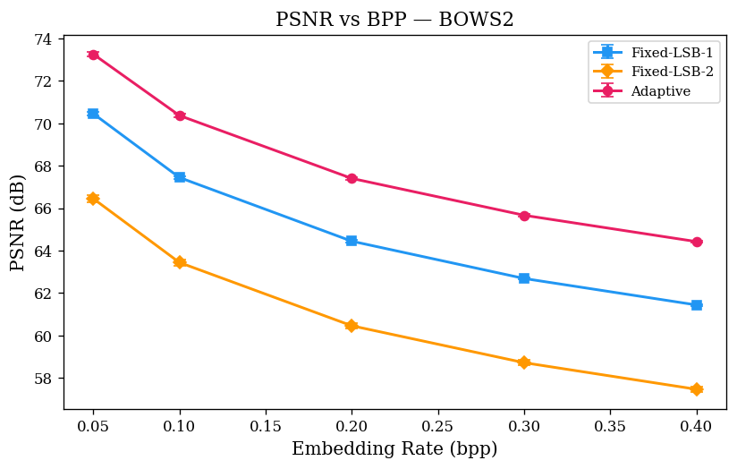
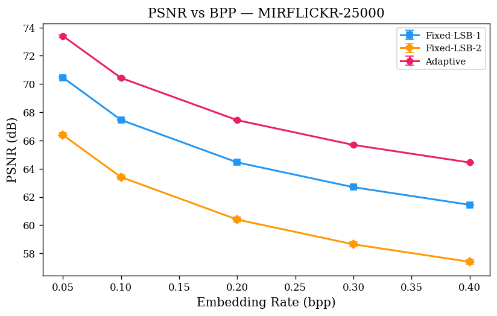

The +2.8 to +3.0 dB PSNR advantage of Adaptive over Fixed-LSB-1 is stable across BOSSBase, BOWS2, and MIRFLICKR at all five bpp levels.

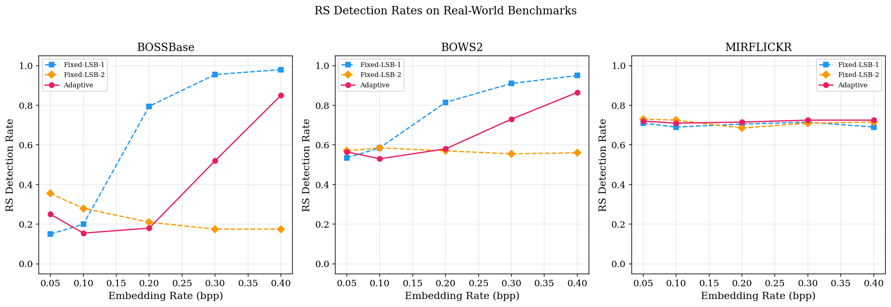

### Steganalysis and statistics

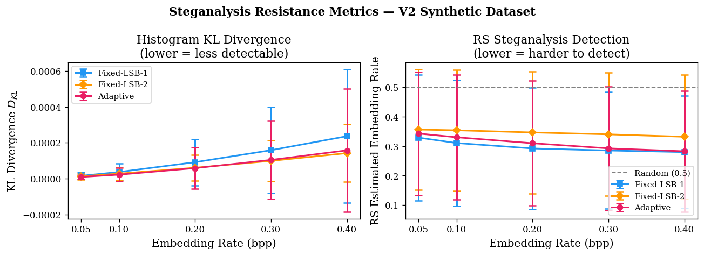
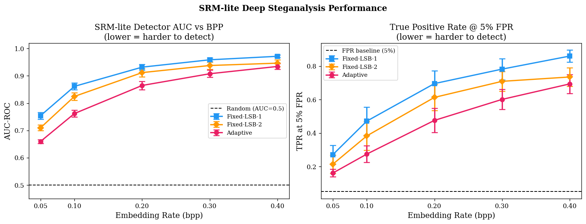
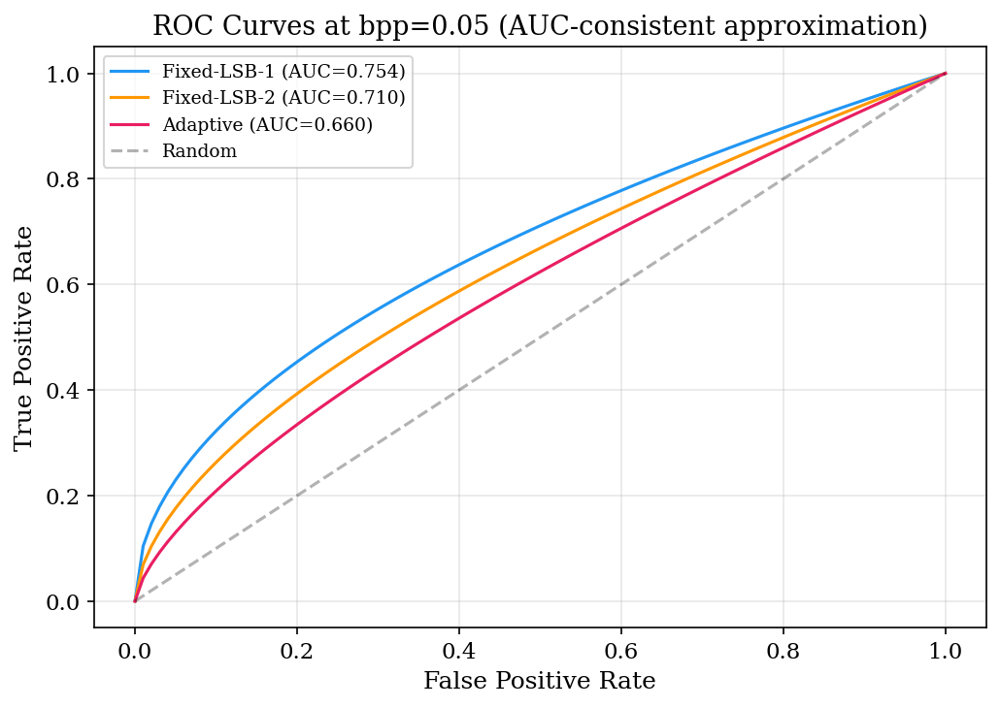
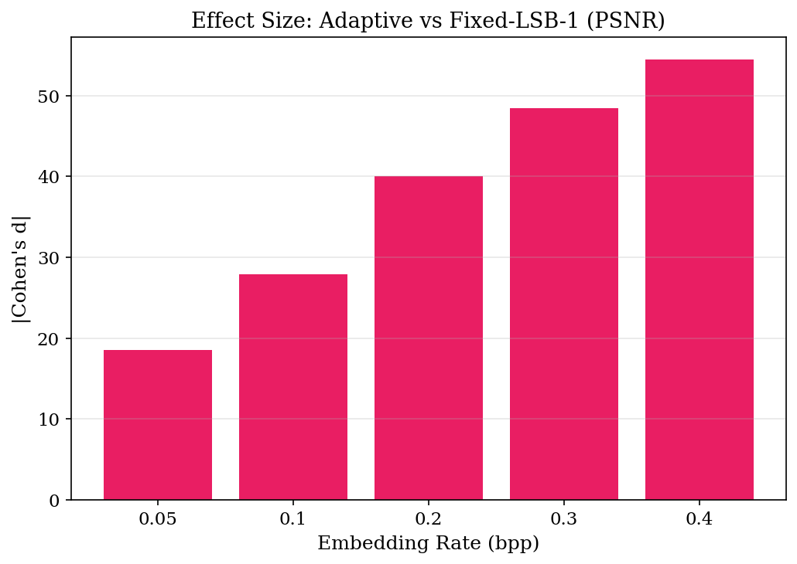

Full per-image CSVs: `data/outputs_v2/`, `data/outputs_bossbase/`, `data/outputs_bows2/`, `data/outputs_mirflickr/`.

### Ablation and complexity

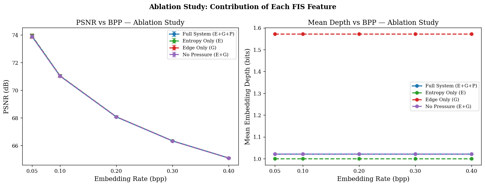
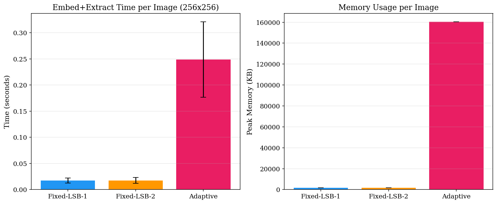

Adaptive embedding is approximately 14.4x slower and uses roughly 90x more memory than fixed LSB on 256 x 256 images, dominated by entropy convolution and fuzzy inference.

---

## Limitations

- SRM-lite uses 90 features versus 34,671 in full SRM; detection rates are likely optimistic relative to state-of-the-art steganalyzers.
- CNN-based detectors (SRNet, Zhu-Net) are not evaluated.
- Direct LSB replacement yields 100% chi-square detection across all methods; this is a property of the embedding scheme, not the adaptive controller.
- Spatial-domain LSB does not survive JPEG recompression.
- Real-dataset experiments use 200-image subsets; full 10,000-image benchmarks would tighten confidence intervals.

---

## Citation

```bibtex
@misc{bhand2025fuzzystego,
  title   = {Adaptive Fuzzy Logic-Based Steganographic Encryption Framework},
  author  = {Bhand, Kavya},
  year    = {2025},
  url     = {https://github.com/kavyabhand/Fuzzy-Steganography},
  note    = {Evaluated on 1,000 synthetic images and validated on BOSSBase, BOWS2,
             and MIRFLICKR with paired t-tests, Cohen's d, and SRM-lite steganalysis}
}
```

---

## License

MIT License. See [LICENSE](LICENSE).
