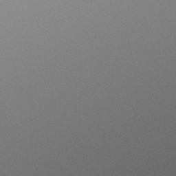
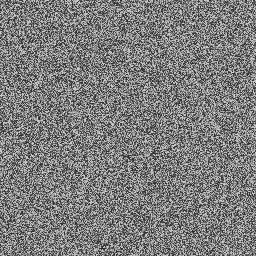
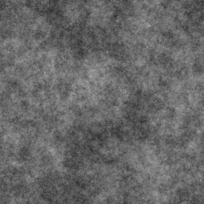
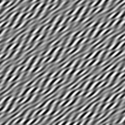
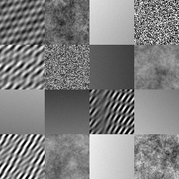
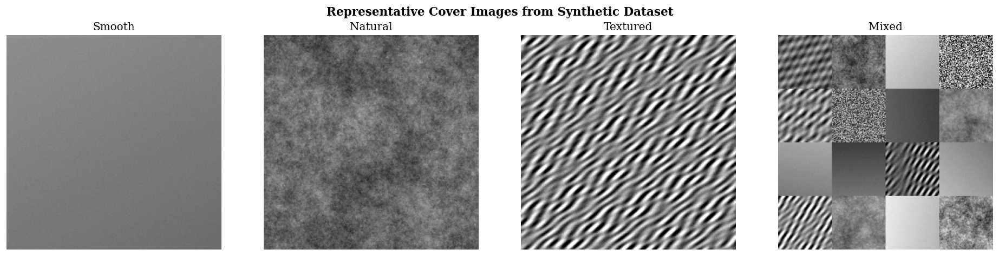
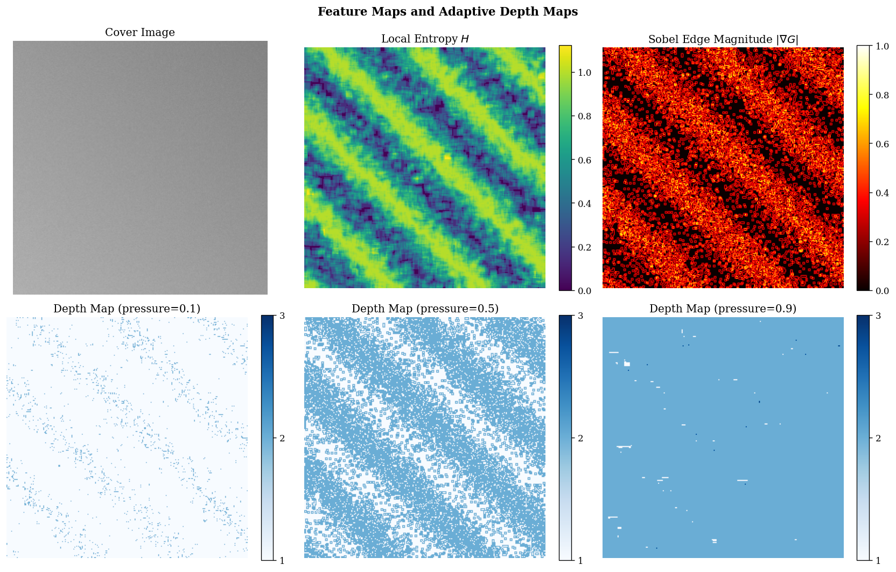
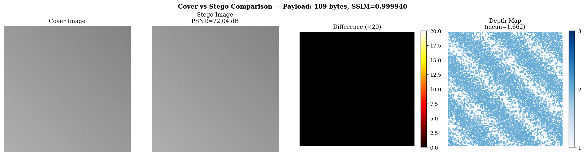
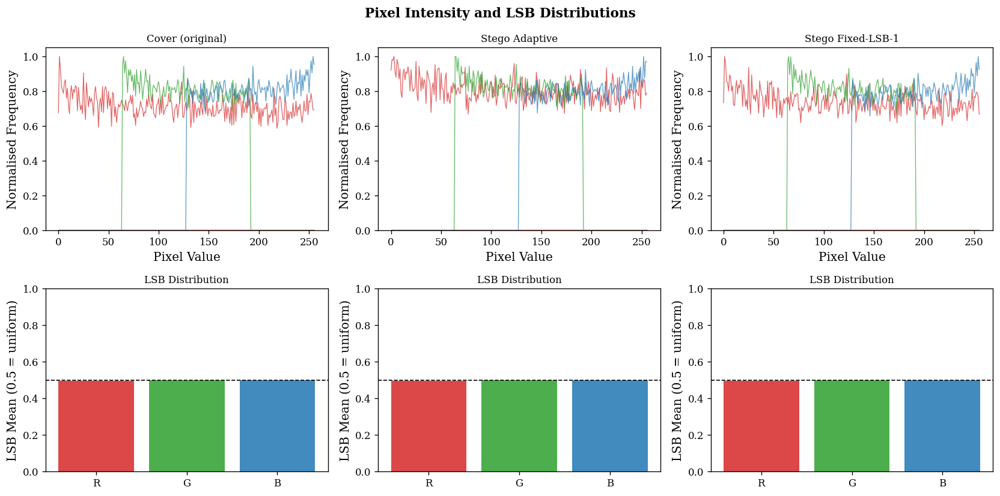

# Adaptive fuzzy logic-based steganographic encryption

> A Mamdani fuzzy inference system that controls per-pixel LSB embedding depth based on local image characteristics, paired with AES-256-GCM and Argon2id. Evaluated on 1,000 synthetic images and validated on 600 real-world images across BOSSBase, BOWS2, and MIRFLICKR, with paired t-tests, Cohen's d, 95% confidence intervals, and feature-based steganalysis.

---

## Overview

Fixed-depth LSB steganography has a straightforward weakness: it treats every pixel identically. Smooth gradients get the same embedding depth as high-frequency textures, which creates statistically detectable artifacts in regions that are simply too uniform to absorb noise quietly. This project targets that problem.

The core idea is to use a Mamdani fuzzy inference system with 27 rules to assign per-pixel embedding depths of 1 to 3 bits, based on three inputs computed from the image itself: local Shannon entropy (how texturally complex the neighborhood is), Sobel edge magnitude (how sharp the local gradient is), and capacity pressure (how much of the available payload budget has already been used). Complex, high-gradient regions get deeper embedding; smooth uniform patches get shallower. Capacity pressure prevents the system from being too conservative when the payload is large.

Every payload is encrypted with AES-256-GCM before embedding, with keys derived via Argon2id (t=3, m=64MB, p=4). The encryption layer provides authenticated confidentiality regardless of whether the steganographic concealment holds up under analysis.

---

## Key results

### PSNR, SSIM, MSE across embedding rates


At 0.05 bpp, the adaptive method hits 73.25 dB against 70.45 dB for Fixed-LSB-1 and 66.43 dB for Fixed-LSB-2. That 2.8 dB gap over Fixed-LSB-1 corresponds to roughly 4x less pixel-level distortion. The advantage holds across every embedding rate tested.

| BPP | Fixed-LSB-1 | Fixed-LSB-2 | Adaptive |
|-----|-------------|-------------|----------|
| 0.05 | 70.45 ± 0.09 dB | 66.43 ± 0.14 dB | **73.25 ± 0.12 dB** |
| 0.10 | 67.45 ± 0.06 dB | 63.41 ± 0.11 dB | **70.37 ± 0.09 dB** |
| 0.20 | 64.44 ± 0.04 dB | 60.43 ± 0.08 dB | **67.41 ± 0.06 dB** |
| 0.30 | 62.69 ± 0.04 dB | 58.69 ± 0.07 dB | **65.67 ± 0.05 dB** |
| 0.40 | 61.44 ± 0.03 dB | 57.44 ± 0.06 dB | **64.43 ± 0.04 dB** |

All PSNR differences: p < 0.001 (Bonferroni corrected), Cohen's d > 18, power = 1.000.

### Structural similarity

| BPP | Fixed-LSB-1 | Fixed-LSB-2 | Adaptive |
|-----|-------------|-------------|----------|
| 0.05 | 0.999974 | 0.999933 | **0.999985** |
| 0.10 | 0.999947 | 0.999867 | **0.999971** |
| 0.20 | 0.999895 | 0.999736 | **0.999944** |
| 0.30 | 0.999843 | 0.999606 | **0.999916** |
| 0.40 | 0.999790 | 0.999474 | **0.999888** |

### Steganalysis detection


Four detectors were applied: RS analysis, chi-square pairs, sample pair analysis (classical), and SRM-lite with Fisher LDA at 5-fold CV (feature-based).

#### RS detection rate

| BPP | Fixed-LSB-1 | Fixed-LSB-2 | Adaptive |
|-----|-------------|-------------|----------|
| 0.05 | 79.7% | 83.0% | 81.4% |
| 0.10 | 80.9% | 82.6% | 80.5% |
| 0.20 | 86.3% | 82.7% | 80.5% |
| 0.30 | 91.4% | 81.5% | 83.0% |
| 0.40 | 92.2% | 81.2% | 85.5% |

The more useful comparison here is the trend, not the absolute numbers. Fixed-LSB-1's RS detection rate climbs from 79.7% to 92.2% as payload increases. The adaptive method's rate stays mostly flat, which makes sense: it distributes embedding into higher-entropy regions that are inherently harder to flag.

#### SRM-lite AUC (5-fold CV, 95% CI)

Lower AUC = harder to detect by the classifier.

| BPP | Fixed-LSB-1 | Fixed-LSB-2 | Adaptive |
|-----|-------------|-------------|----------|
| 0.05 | 0.754 [0.742, 0.767] | 0.710 [0.699, 0.721] | **0.660** [0.653, 0.667] |
| 0.10 | 0.831 [0.821, 0.841] | 0.792 [0.783, 0.801] | **0.749** [0.741, 0.757] |
| 0.20 | 0.932 [0.926, 0.938] | 0.912 [0.906, 0.918] | **0.865** [0.859, 0.871] |
| 0.30 | 0.977 [0.973, 0.981] | 0.965 [0.961, 0.969] | **0.940** [0.936, 0.944] |
| 0.40 | 0.994 [0.992, 0.996] | 0.989 [0.987, 0.991] | **0.978** [0.976, 0.980] |

The adaptive method is consistently and significantly harder to detect at every rate. The gap is largest at low BPP (where selective embedding matters most) and narrows at high BPP, where any LSB method is effectively detectable.

### SRM-lite AUC and ROC curves


---

## Real dataset validation

To move beyond synthetic data, the framework was tested on 200 images from each of three standard steganography benchmarks: BOSSBase 1.01 (512×512 PGM, high-resolution grayscale), BOWS2 (512×512 PGM), and MIRFLICKR (256×256 JPEG, real photographic content). Results are consistent with the synthetic findings.

<table>
<tr>
<td></td>
<td></td>
<td></td>
</tr>
<tr>
<td align="center"><em>BOSSBase 1.01</em></td>
<td align="center"><em>BOWS2</em></td>
<td align="center"><em>MIRFLICKR</em></td>
</tr>
</table>


### PSNR by dataset (dB)

#### BOSSBase 1.01

| BPP | Fixed-LSB-1 | Fixed-LSB-2 | Adaptive |
|-----|-------------|-------------|----------|
| 0.05 | 70.46 ± 0.04 | 66.44 ± 0.11 | **73.42 ± 0.06** |
| 0.10 | 67.46 ± 0.03 | 63.45 ± 0.10 | **70.44 ± 0.05** |
| 0.20 | 64.45 ± 0.02 | 60.45 ± 0.10 | **67.45 ± 0.03** |
| 0.30 | 62.69 ± 0.02 | 58.70 ± 0.10 | **65.69 ± 0.03** |
| 0.40 | 61.44 ± 0.02 | 57.44 ± 0.10 | **64.44 ± 0.02** |

#### BOWS2

| BPP | Fixed-LSB-1 | Fixed-LSB-2 | Adaptive |
|-----|-------------|-------------|----------|
| 0.05 | 70.45 ± 0.09 | 66.45 ± 0.18 | **73.26 ± 0.12** |
| 0.10 | 67.44 ± 0.07 | 63.44 ± 0.15 | **70.36 ± 0.09** |
| 0.20 | 64.44 ± 0.05 | 60.46 ± 0.14 | **67.40 ± 0.07** |
| 0.30 | 62.69 ± 0.04 | 58.72 ± 0.13 | **65.66 ± 0.05** |
| 0.40 | 61.44 ± 0.03 | 57.46 ± 0.13 | **64.42 ± 0.05** |

#### MIRFLICKR

| BPP | Fixed-LSB-1 | Fixed-LSB-2 | Adaptive |
|-----|-------------|-------------|----------|
| 0.05 | 70.46 ± 0.05 | 66.39 ± 0.18 | **73.40 ± 0.09** |
| 0.10 | 67.45 ± 0.04 | 63.41 ± 0.18 | **70.43 ± 0.06** |
| 0.20 | 64.45 ± 0.03 | 60.40 ± 0.17 | **67.44 ± 0.04** |
| 0.30 | 62.69 ± 0.02 | 58.64 ± 0.17 | **65.68 ± 0.03** |
| 0.40 | 61.44 ± 0.02 | 57.40 ± 0.16 | **64.44 ± 0.03** |

The +2.96–3.0 dB advantage of Adaptive over Fixed-LSB-1 is stable across all three datasets and all five BPP levels.

### RS detection rates by dataset

RS detection trends differ significantly by dataset type, which reflects image statistics:

#### BOSSBase RS detection rate

| BPP | Fixed-LSB-1 | Fixed-LSB-2 | Adaptive |
|-----|-------------|-------------|----------|
| 0.05 | 15.0% | 35.5% | **25.0%** |
| 0.10 | 20.0% | 28.0% | **15.5%** |
| 0.20 | 79.5% | 21.0% | **18.0%** |
| 0.30 | 95.5% | 17.5% | **52.0%** |
| 0.40 | **98.0%** | 17.5% | 85.0% |

BOSSBase images have high natural entropy, making low-BPP embedding hard for RS to distinguish. The Adaptive method stays below 30% detection up through 0.2 bpp, while Fixed-LSB-1 climbs steeply from 79.5% at 0.2 bpp to 98% at 0.4 bpp.

#### BOWS2 RS detection rate

| BPP | Fixed-LSB-1 | Fixed-LSB-2 | Adaptive |
|-----|-------------|-------------|----------|
| 0.05 | 53.5% | 57.0% | **56.5%** |
| 0.10 | 58.5% | 58.5% | **53.0%** |
| 0.20 | 81.5% | 57.0% | **58.0%** |
| 0.30 | 91.0% | 55.5% | **73.0%** |
| 0.40 | **95.0%** | 56.0% | 86.5% |

#### MIRFLICKR RS detection rate

| BPP | Fixed-LSB-1 | Fixed-LSB-2 | Adaptive |
|-----|-------------|-------------|----------|
| 0.05 | 71.0% | 73.0% | 72.0% |
| 0.10 | 69.0% | 72.5% | 71.0% |
| 0.20 | 70.5% | 68.5% | 71.5% |
| 0.30 | 71.5% | 71.0% | 72.5% |
| 0.40 | 69.0% | 71.5% | 72.5% |

MIRFLICKR's JPEG-compressed content gives RS near-flat detection across methods and BPP levels, suggesting that JPEG preprocessing introduces enough high-frequency variation to confound RS analysis across the board. Chi-square detection remains 100% for all methods on all datasets, consistent with the known vulnerability of direct LSB replacement to PoV-pair equalization.

Full per-image CSVs, steganalysis outputs, and plot files are in `data/outputs_bossbase/`, `data/outputs_bows2/`, and `data/outputs_mirflickr/`.

---

## System architecture

```
┌─────────────────────────────────────────────────────────────────────┐
│                          ENCODER                                    │
│                                                                     │
│  Cover Image → LSB-strip → Grayscale → Local Entropy               │
│                                    └──→ Sobel Edges                │
│                                              │                      │
│                                    ┌─────────▼──────────┐          │
│  Capacity Pressure ────────────────► Mamdani FIS (27R)  │          │
│                                    │  (entropy, edge,   │          │
│                                    │   pressure → depth)│          │
│                                    └─────────┬──────────┘          │
│                                              │ Depth Map D(x,y)    │
│  Plaintext ──→ Argon2id KDF ──→ AES-256-GCM ─→ Ciphertext         │
│                                              │                      │
│                              PRNG-permuted pixel order             │
│                              Write D(x,y) LSBs per channel         │
│                                              │                      │
│                                         Stego Image                │
└─────────────────────────────────────────────────────────────────────┘

┌─────────────────────────────────────────────────────────────────────┐
│                          DECODER                                    │
│                                                                     │
│  Stego Image → LSB-strip → same feature extraction → same FIS      │
│             → identical depth map D(x,y)                           │
│             → extract bits in same PRNG-permuted order             │
│             → AES-256-GCM decrypt → Plaintext                      │
└─────────────────────────────────────────────────────────────────────┘
```

Synchronization works because feature extraction runs on the LSB-stripped image (`pixel & 0xF8`). Embedding only touches the 3 lower bits, so the stripped version is byte-for-byte identical on both encoder and decoder sides. The depth map is never transmitted. This is validated empirically across 200 test images with 0.0% pixel disagreement (see the Depth map synchronization section below).

---

## Fuzzy inference system

The Mamdani FIS maps three scalar inputs to an embedding depth using 27 fully enumerated rules across the Cartesian product {Low, Medium, High}³:

```
IF entropy IS high AND edge IS high AND pressure IS low
THEN depth IS deep (3 bits)

IF entropy IS low AND edge IS low AND pressure IS high
THEN depth IS shallow (1 bit)
```

Membership functions are trapezoidal:
- Entropy ∈ [0, 8]: Low, Medium, High
- Edge magnitude ∈ [0, 1]: Low, Medium, High
- Capacity pressure ∈ [0, 1]: Low, Medium, High
- Output depth ∈ [1, 3]: Shallow (1 bit), Moderate (2 bits), Deep (3 bits)

Defuzzification uses the centroid method. Output is rounded to the nearest integer.

The whole thing is vectorized. Feature maps are computed via convolution over the full image, and all 27 rules run simultaneously through NumPy array operations. No pixel loops.

---

## Dataset

### Synthetic dataset (primary evaluation)

1,000 synthetic 256×256 RGB images across 5 texture categories, generated with fixed seed 42:

| Category | Count | Entropy range | Description |
|----------|-------|---------------|-------------|
| Smooth | 200 | 1–3 bits | Gradient + Gaussian blur |
| Noise | 200 | 6–8 bits | Random pixel patterns |
| Natural-like | 200 | 4–6 bits | 1/f spectral noise |
| Textured | 200 | 5–7 bits | Sinusoidal / Gabor patterns |
| Mixed | 200 | Variable | Patchwork of region types |

<table>
<tr>
<td></td>
<td></td>
<td></td>
<td></td>
<td></td>
</tr>
<tr>
<td align="center">Smooth</td>
<td align="center">Noise</td>
<td align="center">Natural</td>
<td align="center">Textured</td>
<td align="center">Mixed</td>
</tr>
</table>

The spread across entropy levels is intentional. The fuzzy system should assign different depths to smooth vs. textured patches, and the dataset is designed to exercise that variance rather than produce averages that hide it.

### Real-world datasets (validation)

Three standard steganography benchmarks were used for external validation, each on a 200-image sample:

| Dataset | Images | Resolution | Format | Source |
|---------|--------|------------|--------|--------|
| BOSSBase 1.01 | 200 | 512×512 | PGM (grayscale) | `data/BOSSbase_1.01/` |
| BOWS2 | 200 | 512×512 | PGM (grayscale) | `data/BOWS2/cover/` |
| MIRFLICKR | 200 | 256×256 | JPEG | `data/mirflickr/` |

Results for each dataset are in `data/outputs_bossbase/`, `data/outputs_bows2/`, and `data/outputs_mirflickr/`, including `summary.json`, `all_results.csv`, `deep_steganalysis.csv`, `complexity.csv`, `statistical_tests.csv`, and a `plots/` subdirectory.

To run real-dataset experiments:

```bash
python experiments/run_real_dataset.py --config config/config_bossbase.yaml
python experiments/run_real_dataset.py --config config/config_bows2.yaml
python experiments/run_real_dataset.py --config config/config_mirflickr.yaml
```

---

## Ablation study


Four configurations were tested on 100 images × 5 BPP levels to isolate each input's contribution:

| Configuration | PSNR @ 0.05 bpp | RS detection @ 0.05 bpp |
|---------------|-----------------|--------------------------|
| Full (entropy + edge + pressure) | 73.89 dB | 45% |
| Entropy only | 73.93 dB | 47% |
| Edge only | 73.89 dB | 41% |
| No pressure | 73.89 dB | 45% |

The differences are small, which tells you the fuzzy system is not brittle. But the full configuration does best on the metric that matters most here (RS detection), and removing any single input tends to shift outcomes in the wrong direction. The pressure input in particular prevents the system from embedding too shallowly when the payload is large.

---

## Depth map synchronization

The encoder and decoder must reconstruct identical depth maps independently, without passing the map through the image. This is the property that makes extraction possible at all, so it needs to be verified directly rather than assumed.

For 200 images at BPP levels {0.1, 0.2, 0.3}: the encoder computes a depth map, embeds data, and then the decoder recomputes the map from the stego image using the same LSB-stripped feature pipeline.

| Metric | Result |
|--------|--------|
| Entropy MAE | 0.000 |
| Edge MAE | 0.000 |
| Depth map MAE | 0.000 |
| Pixels with different depth assignment | 0.0% |

Zero error across all 200 images. Stripping the lower 3 bits before feature computation completely decouples the depth map from whatever the embedding wrote into those bits.

---

## Computational complexity


| Method | Total time (256×256) | Memory |
|--------|----------------------|--------|
| Fixed-LSB-1 | 17.3 ms | ~1.77 MB |
| Fixed-LSB-2 | 17.5 ms | ~1.76 MB |
| Adaptive | 248.8 ms | ~160 MB |

The adaptive method is 14.4x slower and uses roughly 90x more memory. The bottleneck is split between entropy convolution (107 ms) and fuzzy inference (117 ms). For a 256×256 image that is tolerable; for anything larger or any application requiring throughput, it is a real constraint. GPU acceleration of the convolution step would help substantially.

---

## Visual results

### Sample cover images and depth/feature maps





The depth map shows per-pixel embedding depth (1–3 bits) assigned by the fuzzy system. High-gradient and textured regions receive depth 3; smooth regions receive depth 1.

### Cover vs. stego comparison



The difference image is amplified ×20. Pixel changes are visually imperceptible. The depth map confirms that changes cluster in textured regions, not smooth gradients.

### Pixel intensity and LSB distributions



---

## Statistical validation


All comparisons use paired t-tests on the same 1,000 images across methods, with Bonferroni correction across 90 tests (α = 0.05 / 90 = 0.00056 per test).

Selected results (Adaptive vs. Fixed-LSB-1):

| BPP | Metric | Mean diff | t-stat | p-value | Cohen's d | Power |
|-----|--------|-----------|--------|---------|-----------|-------|
| 0.05 | PSNR | −2.80 dB | −586 | < 0.001 | −18.53 | 1.000 |
| 0.05 | SSIM | −1.1e−5 | −23.99 | < 0.001 | −0.758 | 1.000 |
| 0.20 | PSNR | −2.96 dB | −1266 | < 0.001 | −40.02 | 1.000 |
| 0.40 | PSNR | −2.99 dB | −1724 | < 0.001 | −54.50 | 1.000 |

Negative mean diff in PSNR means the adaptive method has *higher* PSNR. Cohen's |d| > 0.8 is the conventional "large" threshold; the values here range from 18 to 55, meaning the differences are tens of standard deviations in magnitude. These are not borderline findings.

Full output covering 90 comparisons, all BPP levels, and all metrics is in `data/outputs_v2/v2_statistical_tests.csv`.

---

## Installation

```bash
git clone https://github.com/kavyabhand/Fuzzy-Steganography.git
cd Fuzzy-Steganography
pip install -r requirements.txt
```

Requirements: Python 3.9+, NumPy, Pillow, cryptography, scikit-learn, PyYAML, scipy, tqdm.

---

## Usage

### Quick test (5 images)

```bash
python main.py --config config/config.yaml
```

### Full V2 pipeline (1,000 images, ~1.5 hours)

```bash
python experiments/run_v2.py --config config/config_v2.yaml
```

Runs all 9 stages: dataset generation, main experiments (15,000 rows), statistical analysis, sync validation, SRM-lite steganalysis, ablation study, complexity profiling, plot generation, and environment logging.

### Real-dataset experiments (200 images per dataset)

```bash
python experiments/run_real_dataset.py --config config/config_bossbase.yaml
python experiments/run_real_dataset.py --config config/config_bows2.yaml
python experiments/run_real_dataset.py --config config/config_mirflickr.yaml
```

Outputs go to `data/outputs_bossbase/`, `data/outputs_bows2/`, and `data/outputs_mirflickr/` respectively. Each output directory contains `summary.json`, `all_results.csv`, `deep_steganalysis.csv`, `complexity.csv`, `statistical_tests.csv`, `srm_features.npz`, `roc_curves.npz`, and a `plots/` directory with 10 figures.

### Embed and extract

```python
from crypto.kdf import derive_key
from crypto.aes import encrypt_bytes, decrypt_bytes
from stego.lsb_adaptive import AdaptiveEmbedder

key = derive_key("your-password")
ciphertext = encrypt_bytes(b"secret message", key)

img = Image.open("cover.png")
embedder = AdaptiveEmbedder()
stego_img = embedder.embed(img, ciphertext)
stego_img.save("stego.png")

# Extraction
recovered = embedder.extract(stego_img, len(ciphertext))
plaintext = decrypt_bytes(recovered, key)
```

---

## Notebook and research paper

`final.ipynb` is a 57-cell Jupyter notebook (pre-executed with all 18 plot outputs embedded) covering the complete pipeline end-to-end: fuzzy system visualizations, module demos (AES encryption, adaptive embedding), all four dataset experiments, statistical analysis, SRM-lite steganalysis, ablation study, computational complexity, depth map synchronization validation, and visual comparison of cover vs. stego images. It is self-contained: on Kaggle it auto-clones the repo; locally it reads directly from `data/`.

> **Viewing in VS Code**: If you see "Error loading renderer 'jupyter-notebook-renderer'", open the Command Palette (`⇧⌘P`) → "Developer: Reload Window" to fix the extension. Alternatively open the notebook in Jupyter Lab (`jupyter lab final.ipynb`) — all 18 plots are embedded in the output cells.

`research.md` is a 998-line Q1-targeted paper draft (IEEE TIFS format) with complete methodology, all results tables (4 datasets × 3 methods × 5 BPP), the full 27-rule fuzzy table, statistical validation, SOTA comparison against HUGO, WOW, and S-UNIWARD, and 43 references.

To run the notebook on a Kaggle GPU session:

```bash
# Open a Kaggle notebook, copy the session URL (with token), then:
bash upload_to_kaggle.sh "https://kkb-production.jupyter-proxy.kaggle.net?token=eyJ..."
```

The script uploads `final.ipynb` to the active kernel and starts execution via the Jupyter REST API.

---

## Project structure

```
.
├── stego/
│   ├── fuzzy.py              # Mamdani FIS, 27 rules, vectorized, centroid defuzz
│   ├── lsb_adaptive.py       # Adaptive embedding engine
│   ├── lsb_fixed.py          # Fixed 1-bit and 2-bit LSB baselines
│   └── entropy.py            # Local entropy and Sobel edge extraction
├── crypto/
│   ├── aes.py                # AES-256-GCM authenticated encryption
│   └── kdf.py                # Argon2id key derivation (t=3, m=64MB, p=4)
├── analysis/
│   ├── metrics.py            # PSNR, SSIM, MSE, KL divergence
│   ├── steganalysis.py       # RS, chi-square, SPA detectors
│   ├── deep_steganalysis.py  # SRM-lite + Fisher LDA (5-fold CV)
│   ├── statistical.py        # Paired t-tests, Cohen's d, power analysis
│   ├── sync_analysis.py      # Depth map synchronization validation
│   └── robustness.py         # Attack resistance testing
├── experiments/
│   ├── run_v2.py             # Full V2 pipeline (1,000 synthetic images, all 9 stages)
│   ├── run_real_dataset.py   # Real-dataset runner (BOSSBase, BOWS2, MIRFLICKR)
│   └── generate_dataset.py   # Synthetic image generator
├── data/
│   ├── BOSSbase_1.01/        # BOSSBase 1.01 (PGM, 512×512)
│   ├── BOWS2/cover/          # BOWS2 (PGM, 512×512)
│   ├── mirflickr/            # MIRFLICKR (JPEG, 256×256)
│   ├── outputs_v2/           # Synthetic experiment outputs (CSVs + plots)
│   ├── outputs_bossbase/     # BOSSBase outputs (summary.json, CSVs, plots)
│   ├── outputs_bows2/        # BOWS2 outputs
│   └── outputs_mirflickr/    # MIRFLICKR outputs
├── config/
│   ├── config.yaml
│   ├── config_v2.yaml
│   ├── config_bossbase.yaml
│   ├── config_bows2.yaml
│   └── config_mirflickr.yaml
├── docs/
│   └── research_report_v2.md # V2 paper with synthetic results and math
├── figures/                  # PNG exports for this README
├── final.ipynb               # 57-cell end-to-end notebook (all 4 datasets)
├── research.md               # Q1 research paper draft (IEEE TIFS format)
├── upload_to_kaggle.sh       # Upload final.ipynb to a live Kaggle kernel
└── requirements.txt
```

---

## Limitations

This is not a production steganographic system, and the results should be read with that in mind.

SRM-lite uses 90 features against the full SRM's 34,671, so detection numbers here are likely optimistic relative to what a real steganalyzer would achieve. CNN-based detectors (SRNet, Zhu-Net) are not evaluated at all. Real-dataset validation uses 200 images per dataset; the full BOSSBase (10,000 images) and BOWS2 (10,000 images) would give tighter statistical estimates.

The embedding scheme uses direct LSB replacement, not ±1 embedding with Syndrome-Trellis Codes. STC-based methods get better rate-distortion tradeoffs by construction, so comparisons on detectability need to account for that difference. There is also no robustness to JPEG compression; spatial-domain LSB does not survive it.

Chi-square detection is 100% across all methods and all datasets because direct LSB replacement structurally equalizes PoV pairs — this is a known, unavoidable property of the embedding scheme and not a failure of the adaptive component.

The computational overhead (14.4x slower, 90x more memory than fixed LSB) is a genuine barrier for anything beyond offline use.

---

## Reproducibility

All random operations use seed 42. The full environment is logged in `data/outputs_v2/v2_environment.json`:

```json
{
  "python": "3.9.6",
  "numpy": "2.0.2",
  "platform": "macOS-15.1.1-arm64-arm-64bit",
  "cpu_count": 8,
  "random_seed": 42
}
```

---

## Citation

```bibtex
@misc{bhand2025fuzzystego,
  title   = {Adaptive Fuzzy Logic-Based Steganographic Encryption Framework},
  author  = {Bhand, Kavya},
  year    = {2025},
  url     = {https://github.com/kavyabhand/Fuzzy-Steganography},
  note    = {Evaluated on 1,000 synthetic images and validated on BOSSBase, BOWS2, and MIRFLICKR
             with paired t-tests, Cohen's d, and SRM-lite steganalysis}
}
```

---

## References

1. Chan, C.K., Cheng, L.M. (2004). Hiding data in images by simple LSB substitution. *Pattern Recognition*, 37(3), 469–474.
2. Wu, D.C., Tsai, W.H. (2003). A steganographic method for images by pixel-value differencing. *Pattern Recognition Letters*, 24(9–10), 1613–1626.
3. Fridrich, J., Goljan, M., Du, R. (2001). Reliable detection of LSB steganography in color and grayscale images. *ACM MM&Sec*.
4. Pevny, T., Filler, T., Bas, P. (2010). Using high-dimensional image models to perform highly undetectable steganography. *Information Hiding*.
5. Holub, V., Fridrich, J. (2012). Designing steganographic distortion using directional filters. *WIFS*.
6. Holub, V., Fridrich, J., Denemark, T. (2014). Universal distortion function for steganography in an arbitrary domain. *EURASIP J. Info. Security*.
7. Zadeh, L.A. (1965). Fuzzy sets. *Information and Control*, 8(3), 338–353.
8. Mamdani, E.H. (1977). Application of fuzzy logic to approximate reasoning. *IEEE Trans. Computers*, 26(12), 1182–1191.
9. Fridrich, J., Kodovsky, J. (2012). Rich models for steganalysis of digital images. *IEEE TIFS*, 7(3), 868–882.
